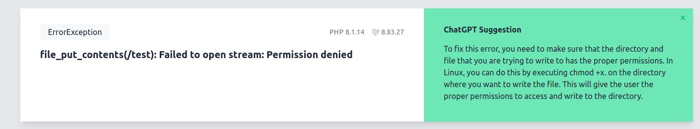

<b>Installation:</b><br>

Install package via composer with <b>--dev</b> flag:
```php
composer require back1ng/chatgptlaravelignition --dev
```

Add this solution to your ignition.php config
```php
    'solution_providers' => [
        \Back1ng\ChatGPTLaravelIgnition\Solutions\ChatGPTSolution::class,
    ],
```

Publish configuration file:
```php
php artisan vendor:publish --provider="Back1ng\ChatGPTLaravelIgnition\ServiceProvider"
```

Add <b>OPENAI_API_KEY</b> to your .env
```php
OPENAI_API_KEY=sk-...
```

Now for each error, there will be a request to ChatGPT.